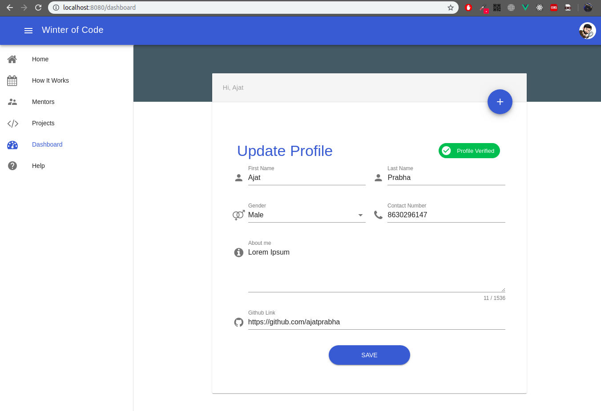

# WoC   
[](https://travis-ci.org/devlup-labs/woc) [](https://coveralls.io/github/devlup-labs/woc?branch=master) 
## Main website for Winter Of Code Projects

### Installation:
Requirements:
- Python 3.6 runtime
- Django 2.1.2
- Other dependencies in `Pipfile`

> For Vuetify UI build steps, follow [this](ui/README.md)

Procedure:
- Install [python](https://www.python.org/downloads/) in your environment(pre-installed on Ubuntu).
- Navigate to the cloned repository.
    ```
    cd <project_directory_name>     # woc
    ```
- Install `pipenv` for dependency management
    ```
    pip install pipenv
    ```
- Copy `.env.example` to `.env`
    ```
    cp .env.example .env
    ```
- Use pipenv to install other dependencies from `Pipfile`
    ```
    pipenv install --dev
    ```
- Change to `src` directory and optionally activate virtual environment, if you don't want to activate env, use `pipenv run` to run python scripts
    ```
    cd src
    source "$(pipenv --venv)"/bin/activate
    ```
- Make database migrations
    ```
    python manage.py makemigrations
    python manage.py migrate
    ```
- Create a superuser
    ```
    python manage.py createsuperuser
    ```
- Run development server on localhost
    ```
    python manage.py runserver
    ```
    
### API Documentation  

The API documentation for this project is available in 3 formats viz.
- JSON -> `/api/docs/swagger.json`
- YAML -> `/api/docs/swagger.yaml`
- Browsable UI -> `/api/docs/swagger/` and `/api/docs/redoc/`
> Note: `DEBUG` should be set to `True` in order to access the API documentation.
